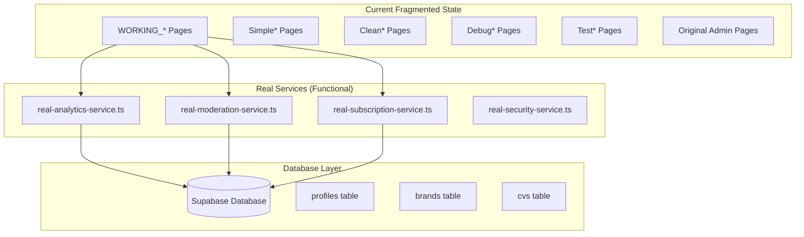
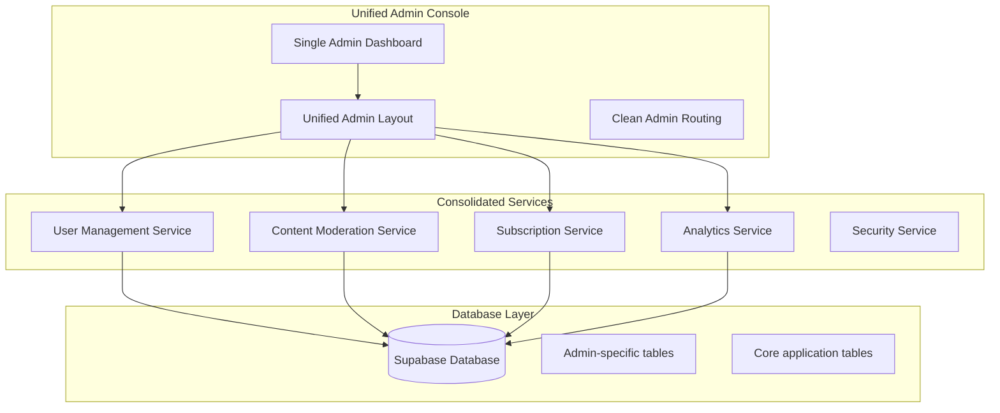

# Admin Console Restoration - Design Document

## Overview

The admin console restoration will systematically clean up the fragmented admin implementation and rebuild a unified, fully functional admin dashboard. The design focuses on consolidating working components, eliminating mock data dependencies, and ensuring reliable Supabase connectivity throughout the admin system.

**Key Design Principles:**
- **Consolidation Over Recreation**: Preserve and enhance working components rather than rebuilding from scratch
- **Real Data Only**: Eliminate all mock data and ensure exclusive Supabase connectivity
- **Single Source of Truth**: Create one unified admin dashboard replacing multiple scattered implementations
- **Progressive Enhancement**: Build on the most stable existing components
- **Clean Architecture**: Establish clear separation between working and broken implementations

## Architecture

### Current State Analysis

Based on codebase analysis, the admin system has multiple implementation layers:



### Target Unified Architecture



## Components and Interfaces

### 1. Consolidated Admin Dashboard

**Source Analysis**: The `WORKING_*` pages demonstrate successful patterns:
- Consistent navigation with back buttons
- Real Supabase data connectivity
- Proper error handling
- Clean UI components

**Target Implementation**:
```typescript
interface UnifiedAdminDashboard {
  layout: AdminLayout;
  navigation: AdminNavigation;
  content: AdminContent;
  services: AdminServices;
}

interface AdminServices {
  userManagement: UserManagementService;
  contentModeration: ContentModerationService;
  subscriptionManagement: SubscriptionManagementService;
  analytics: AnalyticsService;
  security: SecurityService;
}
```

### 2. Service Layer Consolidation

**Working Pattern Analysis**: The `real-*-service.ts` files show successful Supabase integration:

```typescript
// Proven working pattern from real-analytics-service.ts
class ConsolidatedAnalyticsService {
  async getAnalyticsStats(): Promise<AnalyticsStats> {
    const { data: users, error: usersError } = await supabase
      .from('profiles')
      .select('id, created_at, subscription_tier');
    
    if (usersError) throw usersError;
    
    // Real data processing without mock fallbacks
    return this.processRealData(users);
  }
}
```

### 3. Database Connectivity Patterns

**Successful Patterns Identified**:
- Direct Supabase client usage: `supabase.from('table_name')`
- Proper error handling with try/catch blocks
- Real data aggregation and calculation
- No mock data dependencies

**Anti-Patterns to Eliminate**:
- Mock data generators
- Fallback to simulated data
- Hardcoded test values
- Disconnected service stubs

## Data Models

### Working Database Schema

Based on successful implementations, the following tables are confirmed functional:

```sql
-- Core tables with confirmed connectivity
profiles (id, email, full_name, subscription_tier, app_role, created_at)
brands (id, user_id, title, created_at, updated_at)
cvs (id, user_id, title, created_at, updated_at)

-- Admin-specific tables (to be verified/created)
admin_audit_log (admin_user_id, action_type, target_id, details, created_at)
content_moderation_queue (content_id, content_type, status, moderator_id)
```

### Data Access Patterns

**Proven Working Patterns**:
```typescript
// User management - from working implementations
const getUserStats = async () => {
  const { data: profiles } = await supabase
    .from('profiles')
    .select('id, subscription_tier, created_at');
  
  return {
    totalUsers: profiles?.length || 0,
    paidUsers: profiles?.filter(p => p.subscription_tier !== 'free').length || 0
  };
};

// Content moderation - from working implementations  
const getContentStats = async () => {
  const { data: brands } = await supabase
    .from('brands')
    .select('id, created_at, user_id');
    
  const { data: cvs } = await supabase
    .from('cvs')
    .select('id, created_at, user_id');
    
  return {
    totalContent: (brands?.length || 0) + (cvs?.length || 0)
  };
};
```

## Error Handling

### Successful Error Handling Patterns

From working implementations:
```typescript
try {
  const { data, error } = await supabase.from('table').select('*');
  if (error) throw error;
  return data;
} catch (error) {
  console.error('Database error:', error);
  throw new Error('Failed to fetch data');
}
```

### Error Recovery Strategy

1. **Database Connection Errors**: Graceful degradation with user-friendly messages
2. **Permission Errors**: Clear feedback about insufficient admin privileges  
3. **Data Validation Errors**: Specific field-level error messages
4. **Service Unavailable**: Retry mechanisms with exponential backoff

## Testing Strategy

### Component Validation

**Working Component Tests**:
- Verify `WORKING_*` pages maintain functionality
- Test real service connectivity
- Validate data flow from Supabase to UI
- Confirm no mock data dependencies

**Integration Tests**:
- End-to-end admin workflows
- Database transaction integrity
- Authentication and authorization flows
- Cross-service data consistency

### Mock Data Elimination Tests

**Verification Strategy**:
```typescript
// Test to ensure no mock data usage
describe('Admin Services - Real Data Only', () => {
  it('should never return hardcoded mock data', async () => {
    const service = new AdminService();
    const data = await service.getData();
    
    // Verify data comes from database
    expect(data).not.toContain('mock');
    expect(data).not.toContain('fake');
    expect(data).not.toContain('test@example.com');
  });
});
```

## Implementation Strategy

### Phase 1: Analysis and Inventory (Task 1)

**Objective**: Document current state and identify working components

**Activities**:
- Review existing admin-functions spec requirements
- Catalog all admin page implementations
- Test database connectivity for each service
- Identify working vs broken components
- Document successful patterns and anti-patterns

**Deliverables**:
- Comprehensive inventory of admin implementations
- Working component identification report
- Database connectivity assessment
- Mock data usage audit

### Phase 2: Working Component Consolidation (Task 2)

**Objective**: Preserve and enhance functional implementations

**Activities**:
- Extract working patterns from `WORKING_*` pages
- Consolidate `real-*-service.ts` implementations
- Eliminate duplicate and broken implementations
- Establish unified routing and navigation
- Remove all mock data dependencies

**Deliverables**:
- Consolidated admin service layer
- Unified admin page components
- Clean routing configuration
- Mock data elimination verification

### Phase 3: Unified Admin Console Assembly (Task 3)

**Objective**: Create single, fully functional admin dashboard

**Activities**:
- Integrate consolidated components into unified dashboard
- Implement consistent navigation and layout
- Ensure reliable Supabase connectivity throughout
- Add comprehensive error handling
- Perform end-to-end testing

**Deliverables**:
- Single, unified admin console
- Comprehensive admin functionality
- Reliable database connectivity
- Complete mock data elimination
- Full admin workflow testing

## Success Criteria

### Functional Requirements

1. **Single Admin Entry Point**: One unified admin dashboard accessible via `/admin`
2. **Real Data Connectivity**: All admin functions connect exclusively to Supabase
3. **No Mock Data**: Complete elimination of simulated or test data
4. **Core Admin Functions**: Working user management, content moderation, subscription management
5. **Reliable Navigation**: Consistent routing and layout across all admin sections

### Technical Requirements

1. **Database Connectivity**: 100% Supabase integration with no fallbacks
2. **Error Handling**: Graceful error management with user-friendly messages
3. **Performance**: Fast loading times with efficient database queries
4. **Security**: Proper admin authentication and authorization
5. **Maintainability**: Clean, consolidated codebase with clear separation of concerns

### Quality Assurance

1. **Code Consolidation**: Elimination of duplicate admin implementations
2. **Service Integration**: Unified service layer with consistent patterns
3. **UI Consistency**: Coherent design and navigation throughout admin console
4. **Data Integrity**: Reliable data operations with proper validation
5. **Testing Coverage**: Comprehensive tests ensuring functionality and reliability