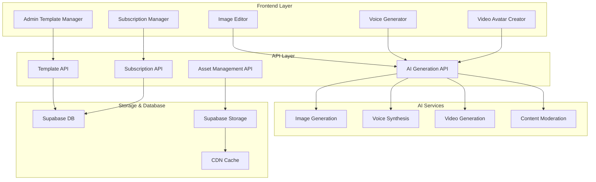

# AI Content Generation - Design Document

## Overview

The AI Content Generation system extends the existing Personal Brand Generator with advanced AI capabilities for image generation, voice synthesis, and video avatar creation. The architecture leverages multiple AI service providers with intelligent fallbacks, implements subscription-based feature gating, and provides comprehensive admin tools for template and asset management.

## Architecture

### System Components



### AI Service Integration Strategy

The system prioritizes OpenAI as the preferred AI partner with strategic fallbacks:

**Image Generation:**
- Primary: OpenAI DALL-E 3 (preferred partner, high quality)
- Secondary: Stability AI (cost-effective fallback)
- Fallback: Custom image generation with templates

**Voice Synthesis:**
- Primary: OpenAI TTS (preferred partner, reliable)
- Secondary: ElevenLabs (natural voices fallback)
- Fallback: Azure Cognitive Services (enterprise backup)

**Video Generation:**
- Primary: OpenAI-compatible video services (when available)
- Secondary: D-ID or Synthesia (avatar generation)
- Fallback: Custom avatar system with OpenAI-generated static images + animations

## Components and Interfaces

### 1. Admin Template Management System

**Template Manager Interface:**
```typescript
interface TemplateManager {
  createTemplate(template: TemplateData): Promise<Template>
  updateTemplate(id: string, updates: Partial<TemplateData>): Promise<Template>
  deleteTemplate(id: string): Promise<void>
  listTemplates(filters: TemplateFilters): Promise<Template[]>
  previewTemplate(id: string, sampleData: any): Promise<string>
}

interface TemplateData {
  name: string
  type: 'brand_rider' | 'cv' | 'presentation'
  htmlContent: string
  styleSheet: string
  placeholders: PlaceholderConfig[]
  metadata: TemplateMetadata
}
```

**Placeholder Image Manager:**
```typescript
interface PlaceholderManager {
  uploadImage(file: File, metadata: ImageMetadata): Promise<PlaceholderImage>
  categorizeImage(id: string, category: ImageCategory): Promise<void>
  generatePlaceholder(prompt: string, category: ImageCategory): Promise<PlaceholderImage>
  searchImages(query: ImageSearchQuery): Promise<PlaceholderImage[]>
}
```

### 2. AI Generation Service Layer

**Unified AI Service Interface:**
```typescript
interface AIGenerationService {
  generateImage(prompt: string, options: ImageOptions): Promise<GeneratedImage>
  generateVoice(text: string, options: VoiceOptions): Promise<GeneratedAudio>
  generateVideo(config: VideoConfig): Promise<GeneratedVideo>
  moderateContent(content: any): Promise<ModerationResult>
}

interface ImageOptions {
  style: 'professional' | 'creative' | 'minimal' | 'bold'
  dimensions: { width: number; height: number }
  format: 'logo' | 'avatar' | 'background' | 'icon'
  colorPalette?: string[]
}

interface VoiceOptions {
  voice: string
  speed: number
  pitch: number
  emotion: 'neutral' | 'energetic' | 'professional' | 'friendly'
  maxDuration: 10 // seconds
}

interface VideoConfig {
  avatarStyle: AvatarStyle
  script: string
  background: BackgroundConfig
  animations: AnimationConfig[]
  duration: 10 // seconds
}
```

### 3. Subscription-Based Feature Gating

**Feature Access Control:**
```typescript
interface FeatureGate {
  canAccessFeature(userId: string, feature: AIFeature): Promise<boolean>
  getUsageLimit(userId: string, feature: AIFeature): Promise<UsageLimit>
  trackUsage(userId: string, feature: AIFeature, cost: number): Promise<void>
  checkQuota(userId: string, feature: AIFeature): Promise<QuotaStatus>
}

enum AIFeature {
  IMAGE_GENERATION = 'image_generation',
  VOICE_SYNTHESIS = 'voice_synthesis',
  VIDEO_GENERATION = 'video_generation',
  ADVANCED_EDITING = 'advanced_editing'
}

interface UsageLimit {
  monthly: number
  daily: number
  perRequest: number
  costLimit: number // in cents
}
```

### 4. Image Editing System

**Image Editor Component:**
```typescript
interface ImageEditor {
  loadImage(source: string | File): Promise<void>
  crop(bounds: CropBounds): Promise<void>
  resize(dimensions: Dimensions): Promise<void>
  applyFilter(filter: ImageFilter): Promise<void>
  addText(text: TextOverlay): Promise<void>
  removeBackground(): Promise<void>
  enhanceQuality(): Promise<void>
  export(format: 'png' | 'jpg' | 'svg'): Promise<Blob>
}

interface TextOverlay {
  text: string
  position: { x: number; y: number }
  font: FontConfig
  color: string
  effects: TextEffect[]
}
```

## Data Models

### Template Management

```sql
-- Templates table
CREATE TABLE ai_templates (
  id UUID PRIMARY KEY DEFAULT gen_random_uuid(),
  name VARCHAR(255) NOT NULL,
  type template_type NOT NULL,
  html_content TEXT NOT NULL,
  style_sheet TEXT,
  placeholders JSONB DEFAULT '[]',
  metadata JSONB DEFAULT '{}',
  is_active BOOLEAN DEFAULT true,
  created_by UUID REFERENCES profiles(id),
  created_at TIMESTAMP WITH TIME ZONE DEFAULT NOW(),
  updated_at TIMESTAMP WITH TIME ZONE DEFAULT NOW()
);

-- Placeholder images table
CREATE TABLE placeholder_images (
  id UUID PRIMARY KEY DEFAULT gen_random_uuid(),
  filename VARCHAR(255) NOT NULL,
  storage_path TEXT NOT NULL,
  category image_category NOT NULL,
  tags TEXT[] DEFAULT '{}',
  metadata JSONB DEFAULT '{}',
  ai_generated BOOLEAN DEFAULT false,
  generation_prompt TEXT,
  created_at TIMESTAMP WITH TIME ZONE DEFAULT NOW()
);
```

### AI Generation Tracking

```sql
-- AI generation requests table
CREATE TABLE ai_generation_requests (
  id UUID PRIMARY KEY DEFAULT gen_random_uuid(),
  user_id UUID REFERENCES profiles(id),
  feature ai_feature_type NOT NULL,
  provider VARCHAR(50) NOT NULL,
  prompt TEXT,
  options JSONB DEFAULT '{}',
  result_url TEXT,
  cost_cents INTEGER DEFAULT 0,
  processing_time_ms INTEGER,
  status generation_status DEFAULT 'pending',
  error_message TEXT,
  created_at TIMESTAMP WITH TIME ZONE DEFAULT NOW()
);

-- Usage tracking table
CREATE TABLE ai_usage_tracking (
  id UUID PRIMARY KEY DEFAULT gen_random_uuid(),
  user_id UUID REFERENCES profiles(id),
  feature ai_feature_type NOT NULL,
  usage_count INTEGER DEFAULT 1,
  total_cost_cents INTEGER DEFAULT 0,
  period_start DATE NOT NULL,
  period_end DATE NOT NULL,
  subscription_tier VARCHAR(20),
  created_at TIMESTAMP WITH TIME ZONE DEFAULT NOW()
);
```

### Generated Content

```sql
-- Generated assets table
CREATE TABLE generated_assets (
  id UUID PRIMARY KEY DEFAULT gen_random_uuid(),
  user_id UUID REFERENCES profiles(id),
  asset_type asset_type NOT NULL,
  storage_path TEXT NOT NULL,
  generation_request_id UUID REFERENCES ai_generation_requests(id),
  metadata JSONB DEFAULT '{}',
  is_public BOOLEAN DEFAULT false,
  moderation_status moderation_status DEFAULT 'pending',
  created_at TIMESTAMP WITH TIME ZONE DEFAULT NOW()
);
```

## Error Handling

### AI Service Resilience

**Provider Fallback Strategy:**
```typescript
class AIServiceOrchestrator {
  private providers: Map<AIFeature, AIProvider[]>
  
  async generateWithFallback<T>(
    feature: AIFeature,
    request: any,
    options: GenerationOptions
  ): Promise<T> {
    const providers = this.providers.get(feature) || []
    
    for (const provider of providers) {
      try {
        const result = await provider.generate(request, options)
        await this.trackSuccess(provider, feature)
        return result
      } catch (error) {
        await this.trackFailure(provider, feature, error)
        if (this.isRetryableError(error) && provider !== providers[providers.length - 1]) {
          continue
        }
        throw error
      }
    }
    
    throw new Error('All AI providers failed')
  }
}
```

**Rate Limiting and Cost Control:**
```typescript
class CostController {
  async checkBudget(userId: string, feature: AIFeature, estimatedCost: number): Promise<boolean> {
    const usage = await this.getCurrentUsage(userId)
    const limits = await this.getSubscriptionLimits(userId)
    
    return (usage.totalCost + estimatedCost) <= limits.monthlyCostLimit
  }
  
  async enforceRateLimit(userId: string, feature: AIFeature): Promise<void> {
    const recentRequests = await this.getRecentRequests(userId, feature)
    const limits = await this.getRateLimits(userId, feature)
    
    if (recentRequests.length >= limits.perMinute) {
      throw new RateLimitError('Rate limit exceeded')
    }
  }
}
```

## Testing Strategy

### Unit Testing
- AI service integration mocks
- Template rendering validation
- Subscription tier logic verification
- Image processing pipeline testing

### Integration Testing
- End-to-end AI generation workflows
- Multi-provider fallback scenarios
- Subscription upgrade/downgrade flows
- Template management operations

### Performance Testing
- AI generation response times
- Concurrent user load testing
- Storage and CDN performance
- Cost optimization validation

### Security Testing
- Content moderation effectiveness
- File upload security validation
- Subscription bypass prevention
- Admin access control verification

## Deployment Considerations

### Environment Configuration
```typescript
interface AIConfig {
  providers: {
    openai: { 
      apiKey: string
      imageModel: 'dall-e-3' | 'dall-e-2'
      ttsModel: 'tts-1' | 'tts-1-hd'
      voiceOptions: string[]
    }
    stability: { apiKey: string; endpoint: string } // fallback
    elevenlabs: { apiKey: string; voiceId: string } // fallback
    did: { apiKey: string; presenter: string } // video fallback
  }
  limits: {
    maxFileSize: number
    maxGenerationTime: number
    costLimits: Record<SubscriptionTier, number>
  }
  storage: {
    bucket: string
    cdnUrl: string
    maxRetention: number
  }
}
```

### Monitoring and Observability
- AI service response time tracking
- Cost monitoring and alerting
- Usage pattern analysis
- Error rate monitoring by provider
- User satisfaction metrics

### Scalability Considerations
- Background job processing for long-running AI tasks
- CDN caching for generated assets
- Database indexing for usage queries
- Horizontal scaling for API endpoints
- Cost optimization through intelligent provider selection