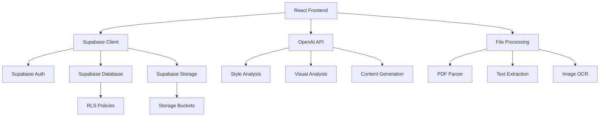

# Personal Brand Generator - Design Document

## Overview

The Personal Brand Generator is a React-based web application that transforms user content into professional brand assets. The system uses a wizard-driven workflow to guide users through upload, analysis, format selection, and generation phases. The architecture leverages Supabase for backend services, OpenAI for content analysis, and client-side rendering for interactive editing.

## Architecture

### Technology Stack
- **Frontend**: React 18 + TypeScript + Vite
- **UI Framework**: TailwindCSS + shadcn/ui + Radix UI
- **Backend**: Supabase (Auth, Database, Storage, RLS)
- **AI Provider**: OpenAI API (with abstraction layer for future providers)
- **PDF Generation**: HTML-to-PDF using jsPDF (client-side) or Playwright (server-side)
- **File Processing**: Client-side text extraction libraries
- **State Management**: React Query for server state, React hooks for local state

### System Architecture



## Components and Interfaces

### Core Workflow Components

#### 1. Upload System
- **UploadStep Component**: Handles file selection and upload
- **FileProcessor Service**: Extracts text from various file types
- **UploadManager**: Manages Supabase storage operations

```typescript
interface UploadResult {
  id: string;
  originalName: string;
  extractedText: string;
  mimeType: string;
  sizeBytes: number;
}

interface FileProcessor {
  extractText(file: File): Promise<string>;
  supportedTypes: string[];
}
```

#### 2. AI Analysis System
- **AIProvider Interface**: Abstraction for AI services
- **StyleAnalyzer**: Processes text for brand voice analysis
- **VisualAnalyzer**: Generates color palettes and font recommendations

```typescript
interface StyleAnalysis {
  tone: {
    adjectives: string[];
    dos: string[];
    donts: string[];
  };
  signaturePhrases: string[];
  strengths: string[];
  weaknesses: string[];
  tagline: string;
  bioOneLiner: string;
}

interface VisualAnalysis {
  palette: ColorSwatch[];
  fonts: FontPair;
  logoPrompt: string;
}

interface ColorSwatch {
  name: string;
  hex: string;
}

interface FontPair {
  heading: string;
  body: string;
}
```

#### 3. Format System
- **FormatStep Component**: Presentation format selection
- **FormatOverlays**: Style modifiers for different presentation types
- **TemplateEngine**: Applies format-specific language transformations

```typescript
type PresentationFormat = 'ufc' | 'military' | 'team' | 'solo' | 'nfl' | 'influencer' | 'custom';

interface FormatOverlay {
  name: string;
  systemPrompt: string;
  styleModifiers: StyleModifier[];
}

interface StyleModifier {
  target: 'tone' | 'language' | 'structure';
  transformation: string;
}
```

#### 4. Generation System
- **BrandGenerator**: Creates Brand Rider documents
- **CVGenerator**: Creates CV documents
- **TemplateRenderer**: Renders documents with format overlays

```typescript
interface BrandRider {
  title: string;
  tagline: string;
  voiceTone: string[];
  signaturePhrases: string[];
  strengths: string[];
  weaknesses: string[];
  palette: ColorSwatch[];
  fonts: FontPair;
  bio: string;
  examples: UsageExample[];
}

interface CV {
  name: string;
  role: string;
  summary: string;
  experience: Role[];
  skills: string[];
  links: Link[];
}

interface Role {
  role: string;
  org: string;
  dates: string;
  bullets: string[];
}
```

### Interactive Editing Components

#### 1. Editor System
- **MarkdownEditor**: Rich text editing with live preview
- **PalettePicker**: Color selection with accessibility validation
- **FontPicker**: Google Fonts integration with live preview
- **LogoGenerator**: AI-powered logo creation

#### 2. Export System
- **PDFExporter**: HTML-to-PDF conversion
- **PNGExporter**: High-quality image generation
- **ShareManager**: Token-based sharing system

### UI Components

#### 1. Layout Components
- **Wizard**: Multi-step process with progress indication
- **Dashboard**: User's brand materials overview
- **Gallery**: Community showcase with search/filter

#### 2. Display Components
- **BrandRiderPreview**: Formatted brand rider display
- **CVPreview**: Formatted CV display
- **TemplateCard**: Gallery item preview

## Data Models

### Database Schema (Supabase)

The existing schema includes:
- `profiles`: User profile information
- `uploads`: File storage metadata and extracted text
- `sources`: External content sources (future feature)
- `brands`: Brand rider data and metadata
- `cvs`: CV data and metadata
- `shares`: Sharing tokens and permissions

### Client-Side Models

```typescript
// Wizard State Management
interface WizardState {
  step: number;
  uploadIds: string[];
  extractedText: string;
  selectedFormat: PresentationFormat;
  styleAnalysis?: StyleAnalysis;
  visualAnalysis?: VisualAnalysis;
  logoUrl?: string;
  brandData?: BrandRider;
  cvData?: CV;
}

// Editor State
interface EditorState {
  content: string;
  isDirty: boolean;
  lastSaved: Date;
  currentPalette: ColorSwatch[];
  currentFonts: FontPair;
}
```

## Error Handling

### Client-Side Error Handling
- **Upload Errors**: File size limits, unsupported formats, network issues
- **AI Errors**: API rate limits, service unavailability, invalid responses
- **Authentication Errors**: Session expiry, permission denied
- **Validation Errors**: Invalid input data, schema violations

### Error Recovery Strategies
- **Retry Logic**: Exponential backoff for transient failures
- **Fallback Options**: Alternative processing methods when primary fails
- **User Feedback**: Clear error messages with actionable guidance
- **State Persistence**: Save progress to prevent data loss

### Error Boundaries
```typescript
interface ErrorBoundaryState {
  hasError: boolean;
  error?: Error;
  errorInfo?: ErrorInfo;
}

// Specific error types for different failure modes
class UploadError extends Error {}
class AIAnalysisError extends Error {}
class ExportError extends Error {}
```

## Testing Strategy

### Unit Testing
- **Component Testing**: React Testing Library for UI components
- **Service Testing**: Jest for business logic and API interactions
- **Utility Testing**: Pure function testing for text processing and validation

### Integration Testing
- **Workflow Testing**: End-to-end wizard flow testing
- **API Integration**: Supabase and OpenAI API interaction testing
- **File Processing**: Upload and text extraction testing

### End-to-End Testing
- **User Journeys**: Complete brand generation workflows
- **Cross-Browser**: Compatibility testing across major browsers
- **Performance**: Load testing for file uploads and AI processing

### Test Data Management
- **Mock Data**: Synthetic brand data for consistent testing
- **Test Users**: Isolated test accounts with known data
- **File Fixtures**: Sample documents for upload testing

## Performance Considerations

### Client-Side Optimization
- **Code Splitting**: Lazy loading for wizard steps and heavy components
- **Image Optimization**: Compressed assets and responsive images
- **Bundle Size**: Tree shaking and dependency optimization

### Server-Side Optimization
- **Caching**: Supabase query caching and CDN for static assets
- **Rate Limiting**: AI API usage optimization and request batching
- **File Processing**: Streaming for large file uploads

### User Experience
- **Loading States**: Progress indicators for long-running operations
- **Offline Support**: Basic functionality when network is unavailable
- **Mobile Responsiveness**: Touch-friendly interface design

## Security Considerations

### Authentication & Authorization
- **Supabase Auth**: OAuth and email/password authentication
- **Row Level Security**: Database-level access control
- **Session Management**: Secure token handling and refresh

### Data Protection
- **Input Validation**: Zod schemas for all user inputs
- **File Security**: Virus scanning and file type validation
- **Privacy Controls**: User-controlled visibility settings

### API Security
- **Rate Limiting**: Prevent abuse of AI services
- **Input Sanitization**: Clean user content before AI processing
- **Error Handling**: Avoid information leakage in error messages

## Accessibility

### WCAG Compliance
- **Color Contrast**: AA-level contrast ratios for all color combinations
- **Keyboard Navigation**: Full keyboard accessibility for all interactions
- **Screen Readers**: Proper ARIA labels and semantic HTML

### Inclusive Design
- **Font Scaling**: Responsive typography that scales with user preferences
- **Focus Management**: Clear focus indicators and logical tab order
- **Alternative Formats**: Multiple export options for different needs

## Deployment and Infrastructure

### Build Process
- **Vite Build**: Optimized production builds with asset optimization
- **Environment Configuration**: Separate configs for development, staging, production
- **CI/CD Pipeline**: Automated testing and deployment

### Hosting
- **Static Hosting**: CDN deployment for React application
- **Supabase Backend**: Managed database, auth, and storage services
- **Domain Configuration**: Custom domain with SSL certificates

### Monitoring
- **Error Tracking**: Client-side error monitoring and reporting
- **Performance Monitoring**: Core Web Vitals and user experience metrics
- **Usage Analytics**: Feature usage and user journey tracking